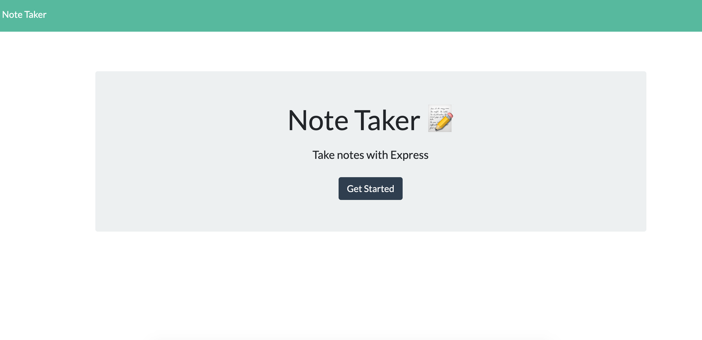
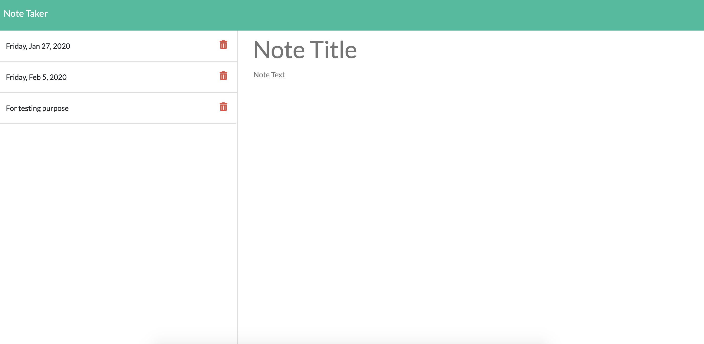

# About note-taker
This is an application that can be used to write, save, and delete notes. This application will use an express backend and save and retrieve note data from a JSON file.

## Demonstration:

## Descriptions:
For users that need to keep track of a lot of information, it's easy to forget or be unable to recall something important. Being able to take persistent notes allows users to have written information available when needed. The application is deployed on heroku. You run the app by starting the command line node .js. 

## Installation: 
https://floating-forest-57848.herokuapp.com/

## Link on GitHub:
https://github.com/iamha1/note-taker
